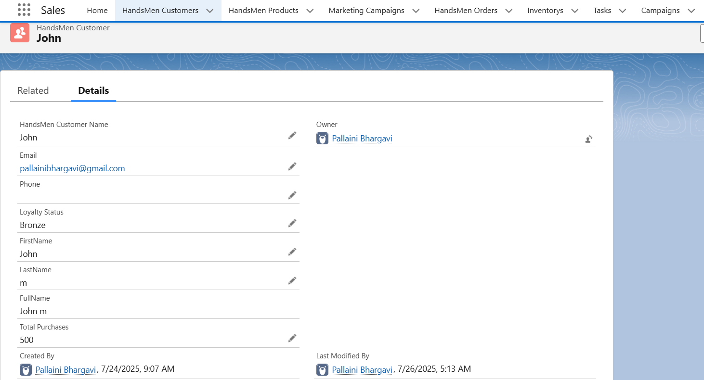
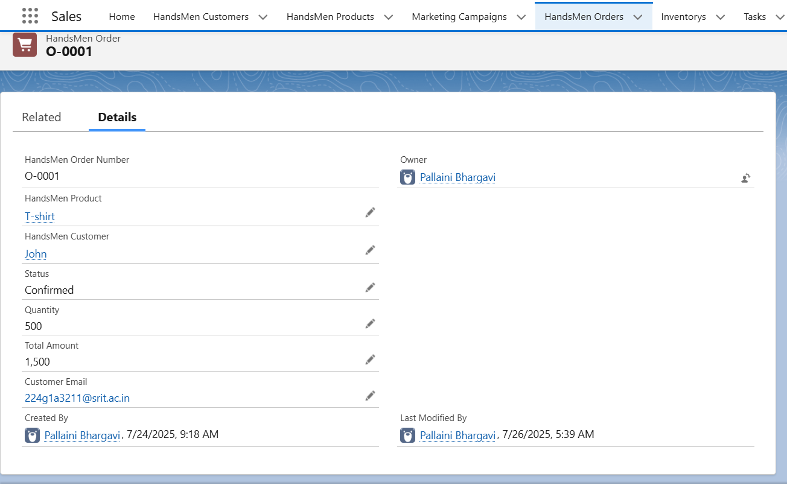
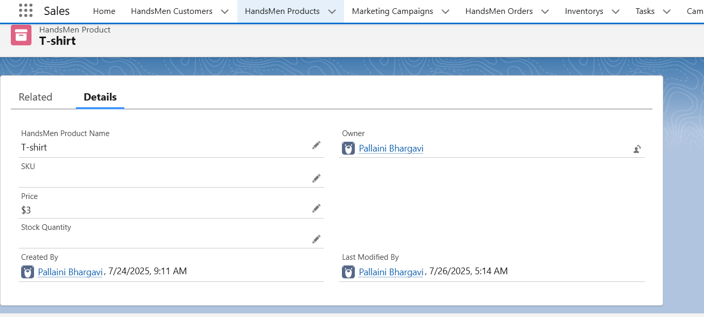
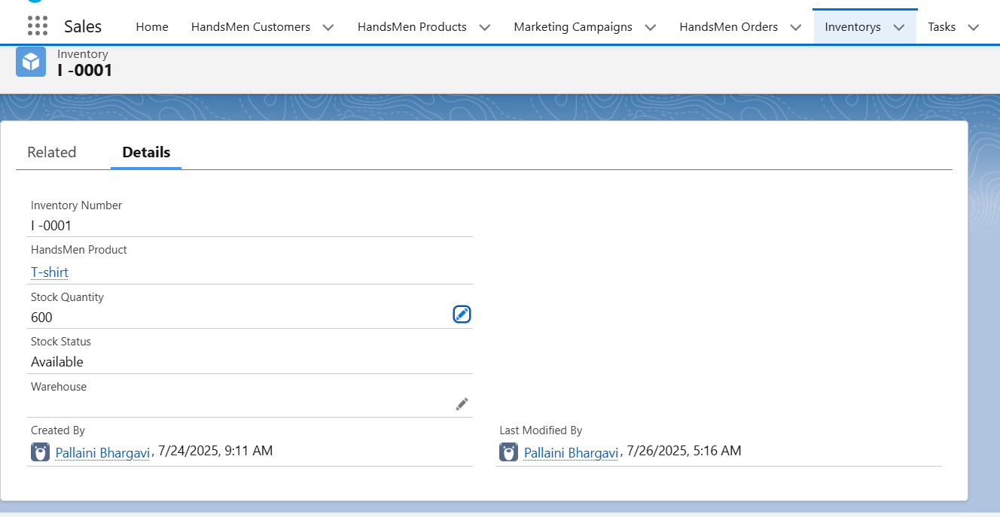
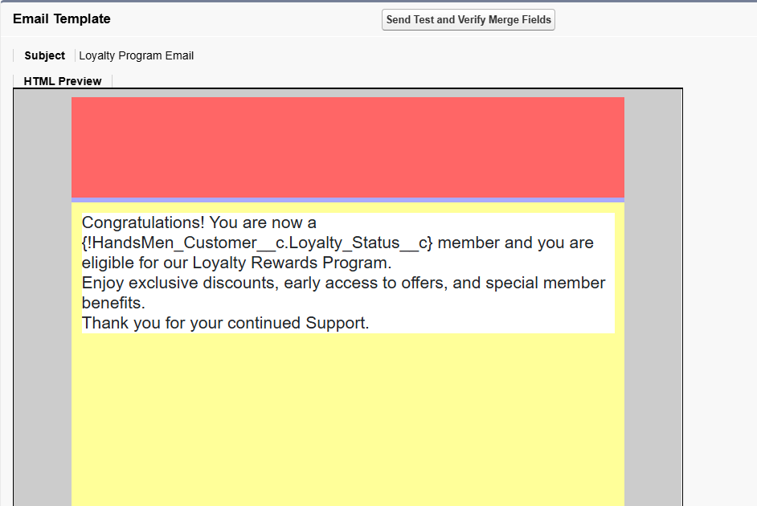
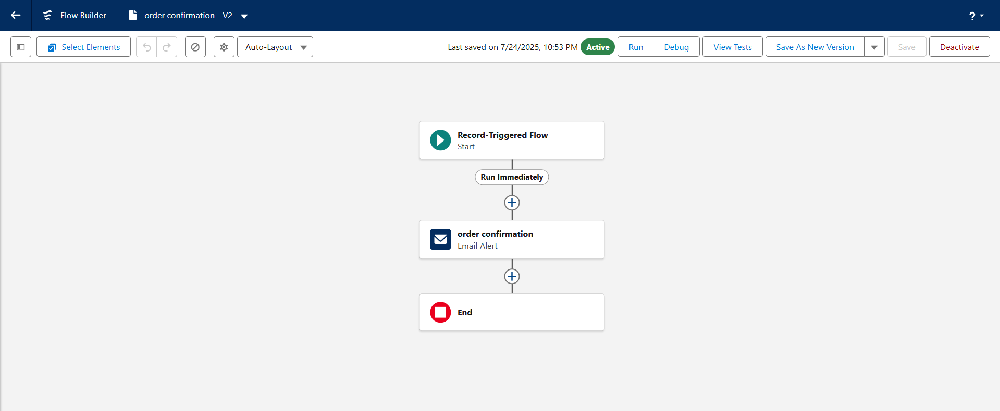
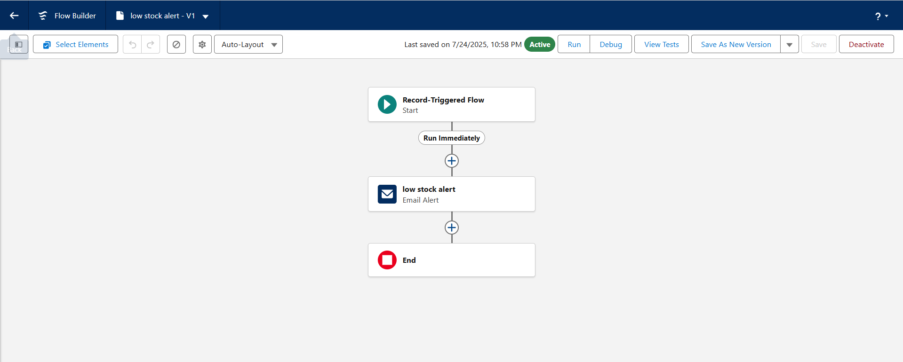
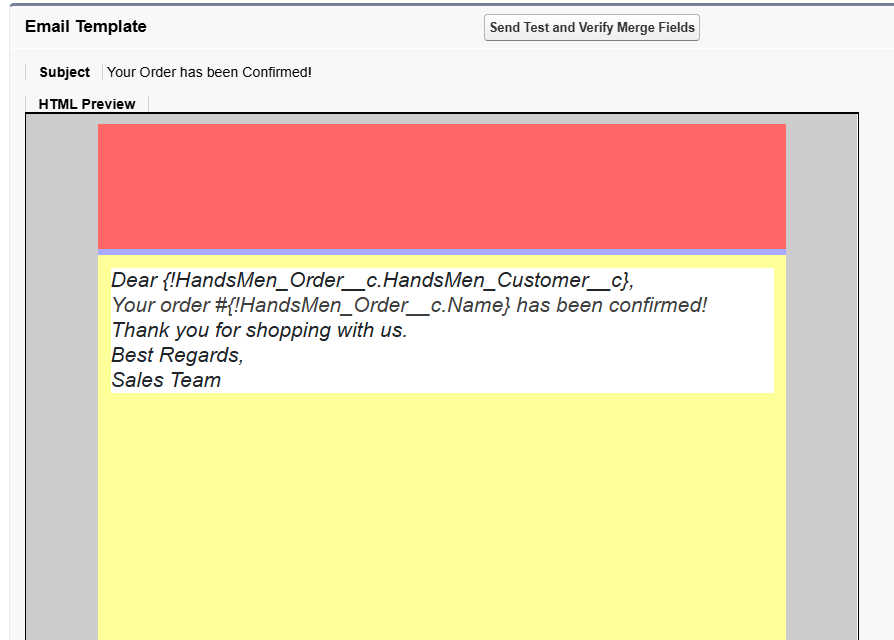
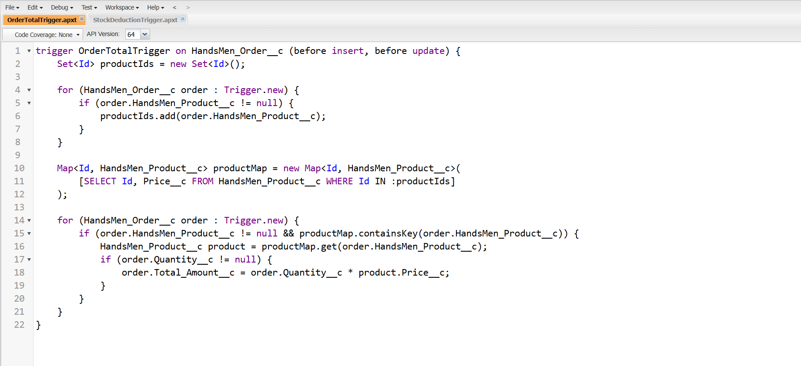

# 🧵 HandsMen Threads - Salesforce Project

**Elevating the Art of Sophistication in Men's Fashion**

This project represents a Salesforce-based digital transformation initiative for *HandsMen Threads*, a forward-thinking fashion brand. The goal is to streamline internal operations and enhance customer engagement through intelligent automation, robust data models, and personalized user experiences.

---

## 🚀 Project Overview

HandsMen Threads is implementing Salesforce to centralize data, automate core workflows, and boost operational efficiency. The application is designed for use by sales, customer service, and inventory management teams to ensure seamless communication and real-time insights across departments.

---

## 🛠️ Key Features

- ✅ **Automated Order Confirmations**  
  Customers receive order confirmation emails instantly after placing an order.

- 🏆 **Dynamic Loyalty Program**  
  Customers' loyalty statuses update automatically based on their purchase history.

- 📦 **Proactive Stock Alerts**  
  Inventory alerts are sent when stock drops below 5 units, ensuring proactive replenishment.

- 🕛 **Scheduled Bulk Order Updates**  
  Nightly batch jobs process bulk orders, update financial records, and adjust inventory automatically.

---

## 📐 Data Model Highlights

- Custom Objects:
  - `Customer`
  - `Order`
  - `Product`
  - `LoyaltyTier`
  - `Inventory`

- Relationships:
  - One-to-many between Customers and Orders
  - Many-to-one between Orders and Products
  - One-to-one between Customer and LoyaltyTier

---

## ⚙️ Technologies & Tools Used

| Tool | Purpose |
|------|---------|
| **Salesforce Lightning App Builder** | Custom UI and layout creation |
| **Record-Triggered Flows** | Automate real-time operations |
| **Apex Triggers** | Execute logic like updating loyalty status |
| **Batch Apex** | Process bulk records (e.g., orders) asynchronously |
| **Validation Rules** | Ensure data integrity from UI |
| **Scheduled Apex** | Run nightly inventory & order updates |

---

## 📚 What I Learned

- Designing scalable **Salesforce Data Models**
- Implementing **automation with Flows and Apex**
- Maintaining **data integrity** using validation rules and Flow error handling
- Building **custom apps** with Lightning App Builder
- Writing **Apex and Asynchronous Apex** for complex operations

---

## 🔗 Project Links

- 🎥 **Demo Video**: [Click Here-Video](https://drive.google.com/file/d/1N2NMRNqPAjz8F8Sg8yL6WUsztrsNXKB7/view?usp=drive_link)
- 💻 **GitHub Repository**:https://github.com/Pallaini-Bhargavi/HandsMen_Threads-Salesforce/ 

### 🔄 Custom Objects: HandsMen Customer

---
### 🔄 Custom Objects: HandsMen Order

---

### 🔄 Custom Objects: HandsMen Product

---

### 🔄 Custom Objects: Inventory

---

### 🔄 Flow: Loyalty Status Update

---

### 🔄 Flow: Order Confirmation

---

### 🔄 Flow: Stock Alert

---

### 🔄 Classic Email Template

---

### 🔄 Developer Console

---

## 📄 License

This project is for academic and showcase purposes. Please feel free to fork or reference for learning purposes.

---

## 💬 Feedback

Have suggestions or want to collaborate? Feel free to open an issue or drop me a message!

